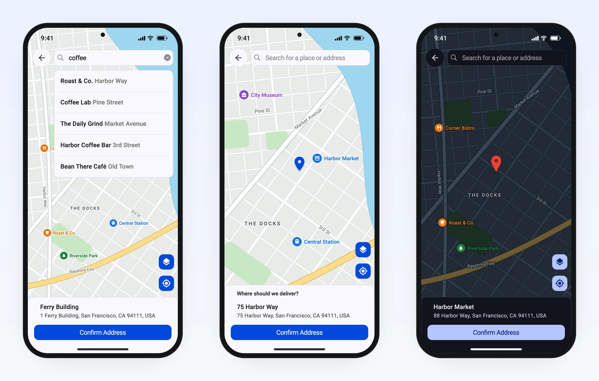
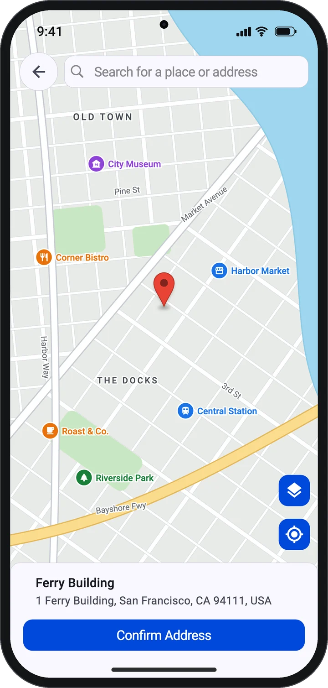
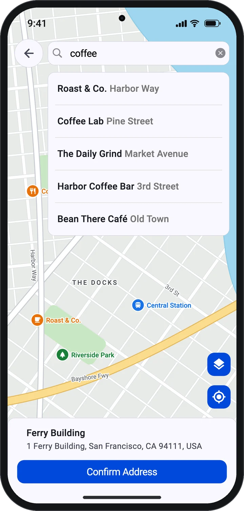
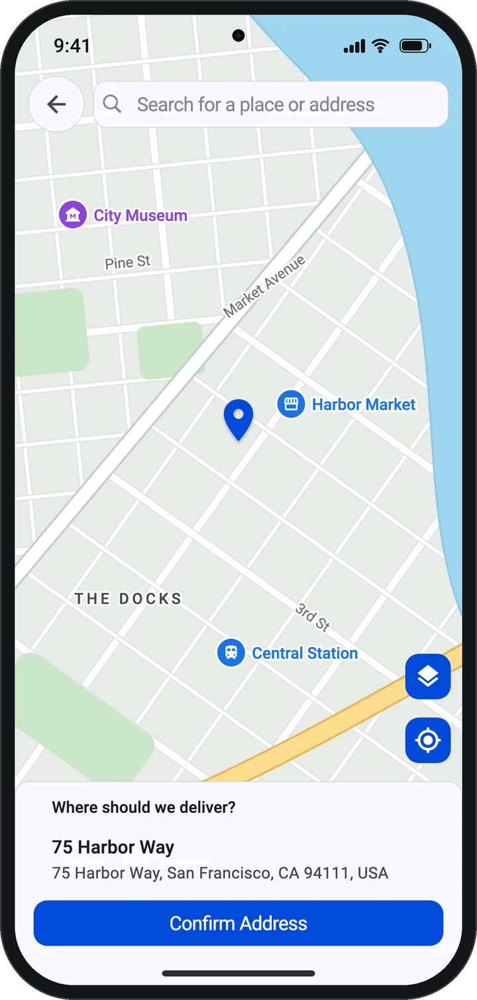
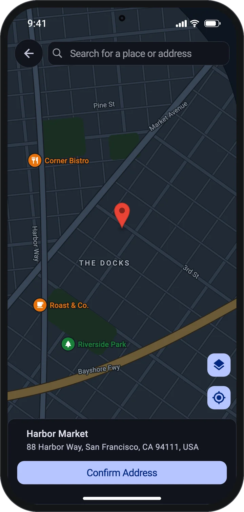
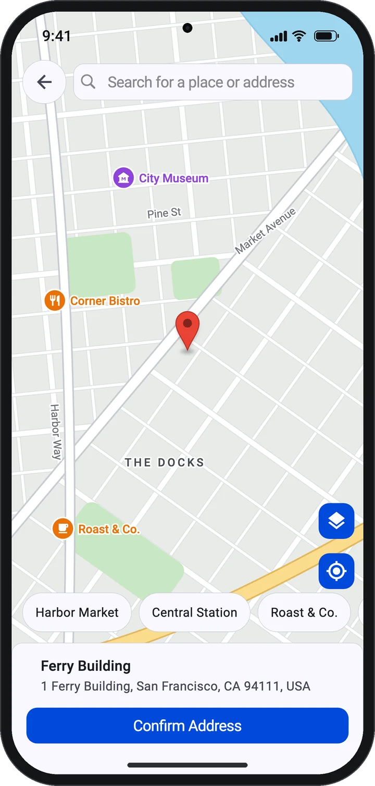
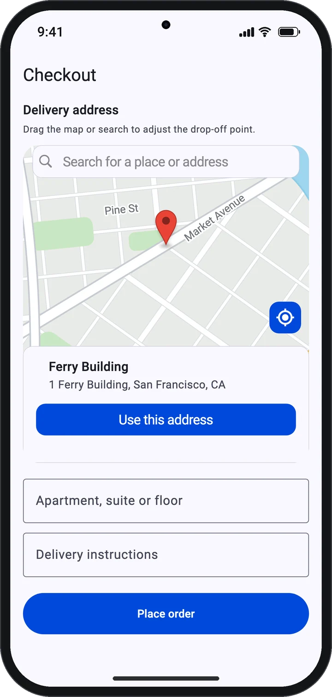
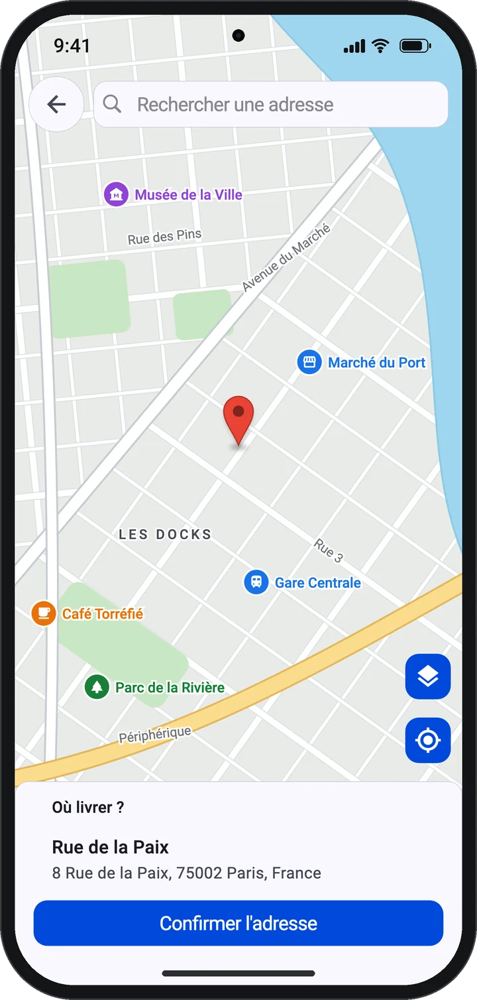
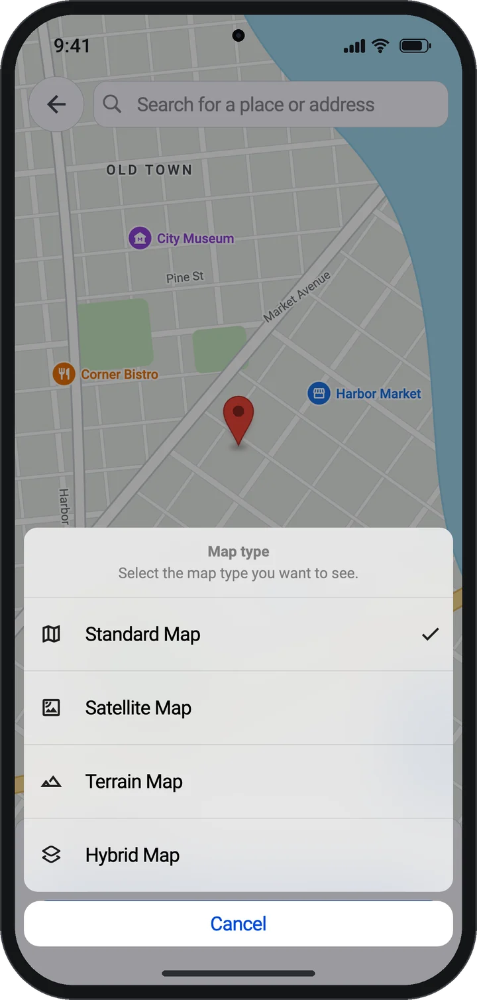

# map_location_picker

[](https://pub.dev/packages/map_location_picker)
[](https://pub.dev/packages/map_location_picker/score)
[](https://github.com/itsarvinddev/map_location_picker/actions/workflows/ci.yml)
[](LICENSE)
[](https://github.com/itsarvinddev/map_location_picker/stargazers)

**A Google Maps location picker for Flutter.** Users search for a place, tap or
drag a marker, or pan the map under a fixed pin. You get back a typed address
you can use straight away.

Works on **Android, iOS and web**. Search uses **Places API (New)** and needs no
CORS proxy.

<p align="center">
  
</p>

```dart
final picked = await showMapLocationPicker(
  context,
  config: const MapLocationPickerConfig(apiKey: 'YOUR_API_KEY'),
);

debugPrint(picked?.formattedAddress); // 1 Ferry Building, San Francisco, CA 94111, USA
```

## Features

- **Two ways to pick.** Tap or drag a marker, or keep a fixed pin in the centre
  while the map moves underneath (the delivery-app pattern).
- **Place search** with Places API (New) autocomplete. Autocomplete is billed
  per session, and each search's session token is reused and then closed
  correctly for you.
- **A typed result.** `PickedPlace` has the coordinates, formatted address,
  street, city, postal code and country code, and the coordinates are there
  even when geocoding fails.
- **Full screen or embedded.** Push the picker as a route and `await` the
  result, or place it inside a form you already have.
- **Programmatic control** through `MapLocationPickerController`: move the map,
  jump to the user's location, change the map type, or read the current
  address.
- **Typed errors.** An invalid key, an exceeded quota and a refused location
  permission each arrive as a different `MapPickerErrorKind`.
- **Built to be customised.** Every visible string can be translated. The theme,
  bottom card, pin, buttons and markers can all be restyled or replaced, and
  nearby places are optional.
- **AI-assistant ready.** An [`llms.txt`](llms.txt) API reference and
  [tested copy-paste prompts](#using-with-ai-coding-assistants).

## Contents

- [Screenshots](#screenshots)
- [Getting started](#getting-started)
- [Usage](#usage)
- [Using with AI coding assistants](#using-with-ai-coding-assistants)
- [Configuration reference](#configuration-reference)
- [API key security and costs](#api-key-security-and-costs)
- [Troubleshooting](#troubleshooting)
- [Migrating from 3.x](#migrating-from-3x)
- [Contributing and support](#contributing-and-support)

## Screenshots

<table>
  <tr>
    <td align="center" width="25%"><br><sub><b>Tap or drag a marker</b></sub></td>
    <td align="center" width="25%"><br><sub><b>Place search</b></sub></td>
    <td align="center" width="25%"><br><sub><b>Centre pin</b></sub></td>
    <td align="center" width="25%"><br><sub><b>Dark theme</b></sub></td>
  </tr>
  <tr>
    <td align="center"><br><sub><b>Nearby places</b></sub></td>
    <td align="center"><br><sub><b>Embedded in a form</b></sub></td>
    <td align="center"><br><sub><b>Localized UI</b></sub></td>
    <td align="center"><br><sub><b>Map types</b></sub></td>
  </tr>
</table>

<sub>These screenshots come from the package's real widgets, generated by
<a href="tool/screenshots">tool/screenshots</a>. A test harness can't load
Google's map tiles, so the map is an illustration. In your app, the picker shows
real Google Maps.</sub>

## Getting started

### Requirements

| | Minimum |
|---|---|
| Flutter | 3.38.1 |
| Dart | 3.10 |
| Android | API 24 (Flutter's default) |
| iOS | 14.0 |
| Web | Any browser Flutter supports; JS and WebAssembly builds |

macOS, Windows and Linux are not supported, because `google_maps_flutter` has
no desktop implementation.

### 1. Install

```yaml
dependencies:
  map_location_picker: ^4.0.1
```

Everything you need comes from one import. `LatLng`, `MapType`,
`GeocodingResult` and the other types are re-exported, so you don't add
`google_maps_flutter` yourself.

```dart
import 'package:map_location_picker/map_location_picker.dart';
```

### 2. Create an API key

In the [Google Cloud console](https://console.cloud.google.com/google/maps-apis/),
turn on billing and enable these APIs for the platforms you ship:

| API | Used for |
|---|---|
| Maps SDK for Android | The map on Android |
| Maps SDK for iOS | The map on iOS |
| Maps JavaScript API | The map on web |
| **Places API (New)** | Search, place details and nearby places |
| Geocoding API | Turning coordinates into addresses |

> [!IMPORTANT]
> Enable **Places API (New)**, not the legacy "Places API". This package only
> calls the new endpoints, and Google has closed the legacy API to projects
> created after 1 March 2025.

### 3. Configure each platform

<details>
<summary><b>Android</b></summary>

In `android/app/src/main/AndroidManifest.xml`:

```xml
<manifest xmlns:android="http://schemas.android.com/apk/res/android">
    <uses-permission android:name="android.permission.ACCESS_COARSE_LOCATION"/>
    <uses-permission android:name="android.permission.ACCESS_FINE_LOCATION"/>

    <application ...>
        <meta-data
            android:name="com.google.android.geo.API_KEY"
            android:value="YOUR_API_KEY"/>
        ...
    </application>
</manifest>
```

</details>

<details>
<summary><b>iOS</b></summary>

The Google Maps plugin requires **iOS 14.0**. Projects created with Flutter
3.38 target iOS 13.0, and `pod install` fails until you raise the target. In
`ios/Podfile`, uncomment the platform line and set it to
`platform :ios, '14.0'`. In Xcode, set **Minimum Deployments** for the Runner
target to 14.0. Newer Flutter templates already target a later version.

In `ios/Runner/AppDelegate.swift`, make two additions and leave everything
else as Flutter generated it:

```swift
import GoogleMaps // next to the existing imports

// Inside application(_:didFinishLaunchingWithOptions:), as the first line:
GMSServices.provideAPIKey("YOUR_API_KEY")
```

Don't replace the whole file. Projects created with Flutter 3.38 register
plugins with `GeneratedPluginRegistrant` in that same method, and newer
templates do it in `didInitializeImplicitFlutterEngine`. Either way, removing
that call leaves the map without its plugin.

In `ios/Runner/Info.plist`:

```xml
<key>NSLocationWhenInUseUsageDescription</key>
<string>Shows your location on the map so you can pick an address.</string>
```

> [!NOTE]
> A location picker doesn't need `NSLocationAlwaysUsageDescription` or
> `UIBackgroundModes: location`. Leave them out unless your app needs
> background location for another reason, because they invite App Store review
> questions.

</details>

<details>
<summary><b>Web</b></summary>

In `web/index.html`, add the Maps JavaScript API **after** `<base href>`:

```html
<base href="$FLUTTER_BASE_HREF">

<script src="https://maps.googleapis.com/maps/api/js?key=YOUR_API_KEY"></script>
```

Load it synchronously, as `google_maps_flutter_web` documents, without `async`
or `loading=async`. The web map plugin creates `google.maps.Map` directly, so
the API must be ready before your app starts.

That script draws the map. Search doesn't depend on it: the package calls the
Places REST API directly, and `places.googleapis.com` supports CORS, so **no
proxy is needed**.

</details>

### 4. Pick a location

```dart
Future<void> chooseLocation(BuildContext context) async {
  final picked = await showMapLocationPicker(
    context,
    config: MapLocationPickerConfig(
      apiKey: 'YOUR_API_KEY',
      onError: (e) => debugPrint('${e.kind}: ${e.message}'),
    ),
  );

  if (picked == null) return; // The user backed out.

  debugPrint(picked.formattedAddress); // 1 Ferry Building, San Francisco, CA 94111, USA
  debugPrint('${picked.latLng}');      // LatLng(37.7955, -122.3937), always present
  debugPrint(picked.city);             // San Francisco
  debugPrint(picked.countryCode);      // US
}
```

That's a complete integration. Everything below is optional.

> [!TIP]
> Keep the key out of source control. Pass it at build time with
> `flutter run --dart-define=MAPS_API_KEY=...`, then read it with
> `const String.fromEnvironment('MAPS_API_KEY')`.

## Usage

### Picking modes

**Marker mode** is the default: the user taps the map or drags the marker.

**Centre-pin mode** keeps a pin fixed in the middle while the user pans the map
underneath, the way most delivery and ride-hailing apps work. The address
resolves once the map stops moving.

```dart
const MapLocationPickerConfig(
  apiKey: 'YOUR_API_KEY',
  pinMode: PickerPinMode.centerPin,
  bottomCardTitle: 'Where should we deliver?',
  showBackButton: true,
)
```

To draw your own pin, pass `centerPinBuilder: (context, state) => ...`. The
`PinState` tells you whether the map is idle or being dragged.

### Starting at the user's location

```dart
const MapLocationPickerConfig(
  apiKey: 'YOUR_API_KEY',
  startWithCurrentLocation: true,
  locationTimeout: Duration(seconds: 8),
)
```

If location services are off or permission is refused, the picker stays at
`initialPosition`. If no fix arrives within `locationTimeout`, it uses the
device's last known position, or `initialPosition` if there isn't one. Either
way it never opens on a blank map, and none of these fallbacks call `onError`.

### Restricting search

```dart
const MapLocationPickerConfig(
  apiKey: 'YOUR_API_KEY',
  countries: ['gb', 'ie'],               // ISO 3166-1 alpha-2, up to 15
  placeTypes: [PlaceType.streetAddress], // up to 5
  language: 'en',                        // language of the returned addresses
)
```

If you need more control, build the filter yourself. Any field you set on it
takes precedence over the shortcuts above:

```dart
MapLocationPicker(
  config: const MapLocationPickerConfig(apiKey: 'YOUR_API_KEY'),
  searchConfig: SearchConfig(
    searchFilter: AutocompleteSearchFilter(includeQueryPredictions: true),
  ),
)
```

`searchConfig`, `geoCodingConfig` and `controller` are separate arguments that
sit beside `config:`. They aren't fields of `MapLocationPickerConfig`.

### Nearby places

Shows places around the pin as chips the user can tap to select.

```dart
const MapLocationPickerConfig(
  apiKey: 'YOUR_API_KEY',
  showNearbyPlaces: true,
  nearbyPlacesRadius: 300, // metres
  nearbyPlacesLimit: 6,
  nearbyPlaceTypes: [PlaceType.restaurant, PlaceType.cafe],
)
```

### Embedding in an existing screen

`MapLocationPicker` has its own `Scaffold` and is meant to be a full-screen
route. To put the picker inside a form, use `MapLocationPickerView`, which takes
the same arguments, and give it a bounded height:

```dart
SizedBox(
  height: 400,
  child: MapLocationPickerView(
    config: MapLocationPickerConfig(
      apiKey: 'YOUR_API_KEY',
      showMapTypeButton: false,
      onMainMarkerPositionChanged: (position) => setState(() => _position = position),
      onAddressDecoded: (result) => setState(() => _address = result?.formattedAddress),
    ),
  ),
)
```

The picker geocodes its starting point without calling
`onMainMarkerPositionChanged`, so initialise `_position` to your
`initialPosition` (or read `controller.position`) rather than waiting for the
first callback.

If the page scrolls, the scroll view claims vertical drags before the map
sees them. Let the map claim them first:

```dart
import 'package:flutter/foundation.dart';
import 'package:flutter/gestures.dart';

MapLocationPickerConfig(
  apiKey: 'YOUR_API_KEY',
  gestureRecognizers: {
    Factory<OneSequenceGestureRecognizer>(() => EagerGestureRecognizer()),
  },
)
```

### Controlling it from code

`MapLocationPickerController` is a `ChangeNotifier`. Create one, pass it as
`controller:`, and dispose of it when you're done.

```dart
final controller = MapLocationPickerController(config: config);

MapLocationPicker(config: config, controller: controller);

await controller.moveTo(const LatLng(48.8584, 2.2945));
await controller.goToCurrentLocation();
controller.setMapType(MapType.hybrid);

ListenableBuilder(
  listenable: controller,
  builder: (context, _) => Text(controller.address),
);

controller.dispose();
```

Besides `address`, it exposes `position`, `isLoading`, `result`, `results`,
`mapType`, `pinState`, `nearbyPlaces` and `lastError`. `confirm()` calls
`onNext` just like tapping Confirm, but it skips the button's checks. Call it
only when `isLoading` is false (and, if you set `requireGeocodedAddress`, only
when `result` isn't null).

### Reading the result

`showMapLocationPicker` returns a `PickedPlace`, or `null` if the user backs out.

| Field | Type | Notes |
|---|---|---|
| `latLng` | `LatLng` | Always present, even if geocoding failed |
| `displayLabel` | `String` | The best single label for the place; never null |
| `formattedAddress` | `String?` | For example `10 Downing St, London SW1A 2AA, UK` |
| `name` | `String?` | The place name, when the user picked a search result |
| `streetNumber`, `street` | `String?` | |
| `city` / `locality`, `administrativeArea` | `String?` | |
| `postalCode` | `String?` | |
| `country`, `countryCode` | `String?` | `countryCode` is ISO alpha-2, for example `GB` |
| `placeId` | `String?` | |
| `result` | `GeocodingResult?` | The raw geocoding result |
| `place` | `Place?` | The raw Places (New) result, when the user picked a search result |

If you work with a `GeocodingResult` directly, for example in `onNext` or
`onAddressDecoded`, the same fields are available as extension getters:
`result.city`, `result.postalCode`, `result.countryCode`, `result.latLng` and
`result.component('administrative_area_level_2')`.

### Handling errors

Failures reach `onError` as a `MapLocationPickerException` with a `kind`, a
`message` and, for HTTP failures, a `statusCode`. The one exception is the
initial lookup for `startWithCurrentLocation`, which falls back quietly
instead. The location kinds come from the my-location button and
`controller.goToCurrentLocation()`.

```dart
MapLocationPickerConfig(
  apiKey: 'YOUR_API_KEY',
  onError: (e) {
    if (!e.isUserFacing) return; // cancelled requests and "no results"

    final message = switch (e.kind) {
      MapPickerErrorKind.requestDenied =>
        'Maps is misconfigured: check the API key and enabled APIs.',
      MapPickerErrorKind.network => 'You appear to be offline.',
      MapPickerErrorKind.locationPermissionDeniedForever =>
        'Allow location access in system settings.',
      _ => e.message,
    };
    ScaffoldMessenger.of(context).showSnackBar(SnackBar(content: Text(message)));
  },
)
```

The other kinds are `cancelled`, `invalidRequest`, `quotaExceeded`,
`noResults`, `locationServiceDisabled`, `locationPermissionDenied`,
`locationTimeout`, `mapUnavailable`, `unsupportedPlatform` and `unknown`.

Key problems look different depending on which API reported them:

- **Search, place details and nearby places** (Places API (New)) take the kind
  from the HTTP status. A wrong key arrives as `invalidRequest` (HTTP 400,
  "API key not valid"). A disabled API, disabled billing or a key restriction
  arrives as `requestDenied` (HTTP 403).
- **The address lookup** (Geocoding API) takes the kind from Google's `status`
  field and has no `statusCode`. A wrong key arrives there as `requestDenied`,
  with the message "The provided API key is invalid."
- **An empty key** fails search with `unknown` in debug builds, because the
  Places client asserts before sending anything, and with `requestDenied` in
  release builds.

### Localization

Every visible string is a field of `MapLocationPickerStrings`, and each has an
English default. Two exceptions are set on the config itself: `bottomCardTitle`,
and `fabTooltip`, the my-location button's tooltip (default `'My Location'`).
Set `language` as well, so Google returns addresses in the same language.

```dart
MapLocationPickerConfig(
  apiKey: 'YOUR_API_KEY',
  language: 'fr',
  bottomCardTitle: 'Où livrer ?',
  fabTooltip: 'Ma position',
  strings: MapLocationPickerStrings(
    searchHint: 'Rechercher une adresse',
    confirmAddress: "Confirmer l'adresse",
    loadingAddress: 'Chargement…',
    noAddressFound: 'Aucune adresse trouvée',
    nearbyPlacesCount: (n) => n == 1 ? '1 adresse' : '$n adresses',
    // ...and 12 more; see the API reference.
  ),
)
```

If you use gen-l10n, the [localization prompt](#using-with-ai-coding-assistants)
adds all 18 strings to your ARB files for you.

### Theming and dark mode

The search bar, bottom card, buttons and sheets use your app's `Theme` and
`ColorScheme`, so they follow light and dark mode automatically. You can
override them with `cardColor` (a translucent colour lets the blurred map show
through), `cardRadius`, `cardBorder`, `floatingControlsColor` and
`floatingControlsIconColor`.

Google's map tiles don't switch automatically. For a dark map, pass a style: a
JSON `mapStyle`, or a `cloudMapId` that has a dark style.

```dart
MapLocationPickerConfig(
  apiKey: 'YOUR_API_KEY',
  mapStyle: Theme.of(context).brightness == Brightness.dark ? darkMapStyleJson : null,
)
```

### Customising the UI

```dart
MapLocationPickerConfig(
  apiKey: 'YOUR_API_KEY',
  floatingControlsPosition: FloatingControlsPosition.bottomStart,
  mainMarkerIcon: myBitmapDescriptor,
  confirmButton: (context, onNext) => FilledButton(
    onPressed: onNext,
    child: const Text('Deliver here'),
  ),
  bottomCardBuilder: (context, result, results, address, isLoading, onNext, searchBar) {
    return MyAddressCard(address: address, loading: isLoading, onConfirm: onNext);
  },
)
```

You can also replace or hide the search bar (`searchBarBuilder`,
`showSearchBar`), the back button (`backButtonBuilder`) and the floating
buttons (`showMapTypeButton`, `showMyLocationButton`). You can add your own
markers with `additionalMarkers`, `customMarkerIcons` and `onMarkerTapped`.

### The search field on its own

```dart
PlacesAutocomplete(
  config: const SearchConfig(apiKey: 'YOUR_API_KEY'),
  onGetDetails: (place) => debugPrint(place?.formattedAddress),
  onError: (e) => debugPrint('${e.kind}: ${e.message}'),
)
```

## Using with AI coding assistants

AI assistants often suggest APIs from older versions of this package, or from
other packages, because that's what their training data contains. Three things
help them get 4.x right.

### 1. Point them at `llms.txt`

[`llms.txt`](https://raw.githubusercontent.com/itsarvinddev/map_location_picker/master/llms.txt)
is a compact, authoritative reference to the 4.x API, written for language
models. It covers the platform setup, the config options most apps use, the result
type, error kinds, localization, testing, troubleshooting and a list of removed
APIs. Assistants that
can browse will read it from the link. For any other assistant, paste the file
into the chat.

### 2. Add project rules

Paste this into your assistant's instructions file so every future request
follows it:

| Tool | File |
|---|---|
| Claude Code | `CLAUDE.md` |
| OpenAI Codex and other tools that read AGENTS.md | `AGENTS.md` |
| GitHub Copilot | `.github/copilot-instructions.md` |
| Cursor | `.cursor/rules/map-location-picker.mdc` |
| Gemini CLI | `GEMINI.md` |

```markdown
## map_location_picker (4.x)

- API reference: https://raw.githubusercontent.com/itsarvinddev/map_location_picker/master/llms.txt. Prefer it over memory; the 3.x APIs no longer exist.
- Import only `package:map_location_picker/map_location_picker.dart`. It re-exports LatLng, MapType, GeocodingResult, Place and PlacesAPINew; don't add google_maps_flutter for them.
- Full-screen picking: `final picked = await showMapLocationPicker(context, config: MapLocationPickerConfig(apiKey: key));` returns `PickedPlace?`. null means the user cancelled, and `picked.latLng` is never null.
- Inside an existing layout, use `MapLocationPickerView` with a bounded height. Never put `MapLocationPicker`, which has its own Scaffold, in a Column or ListView. In a scroll view, set `gestureRecognizers: {Factory<OneSequenceGestureRecognizer>(() => EagerGestureRecognizer())}` so the map gets drags.
- Options are fields of `MapLocationPickerConfig`. `searchConfig:`, `geoCodingConfig:` and `controller:` are separate arguments beside `config:`.
- Handle failures with `onError: (MapLocationPickerException e) { ... }`. Switch on `e.kind` (a `MapPickerErrorKind`), and only show UI when `e.isUserFacing`.
- Google Cloud APIs: Maps SDK for Android, Maps SDK for iOS, Maps JavaScript API, Places API (New) (not the legacy Places API) and Geocoding API.
- Never use MapPickerConfig, PlacesAutocompleteConfig, google_maps_webservice types, `components:`, `result.geometry.location`, a CORS proxy, or background location permissions.
- Tests: subclass `GeoCodingConfig`, override `reverseGeocode`, and drive a `MapLocationPickerController` in plain `test()`.
```

For Cursor, start the `.mdc` file with this front matter so the rule always
applies:

```yaml
---
description: map_location_picker 4.x rules
alwaysApply: true
---
```

### 3. Copy a prompt

Each prompt below is self-contained: open it, copy it, and paste it into your
assistant with your project open. To test them, we gave each prompt to an
assistant that had no access to this package's source, then compiled and
reviewed what it produced.

<details>
<summary><strong>Add a location picker to my app</strong> — First-time setup: dependency, Android/iOS/web configuration, and a button that returns a typed address.</summary>

````text
Add the Flutter package map_location_picker to this app.

Goal: on the home screen, add a "Choose location" button. Tapping it opens a full-screen map picker. After the user confirms, show the picked address and coordinates on screen.

1. Add `map_location_picker: ^4.0.1` to pubspec.yaml and run `flutter pub get`.
2. Read the key with `const mapsApiKey = String.fromEnvironment('MAPS_API_KEY');` rather than hard-coding it.
3. Open the picker and await the result:
   final PickedPlace? picked = await showMapLocationPicker(
     context,
     config: MapLocationPickerConfig(
       apiKey: mapsApiKey,
       onError: (MapLocationPickerException e) => debugPrint('${e.kind}: ${e.message}'),
     ),
   );
   `debugPrint` comes from `package:flutter/material.dart`, so don't add a separate foundation.dart import. null means the user backed out. Check `mounted` before using context after the await. PickedPlace has `latLng` (never null), `displayLabel` (never null), and the nullable `formattedAddress`, `street`, `city`, `postalCode` and `countryCode`.
4. Platform setup, only for the platform folders that exist:
   - Android, android/app/src/main/AndroidManifest.xml: add the ACCESS_COARSE_LOCATION and ACCESS_FINE_LOCATION permissions. Inside <application>, add <meta-data android:name="com.google.android.geo.API_KEY" android:value="YOUR_API_KEY"/>
   - iOS: the Google Maps plugin needs iOS 14.0. If IPHONEOS_DEPLOYMENT_TARGET in ios/Runner.xcodeproj/project.pbxproj is below 14.0, raise it to 14.0. Make ios/Podfile's platform line (uncomment it if needed) match the project's target, never lower than 14.0. Never lower an existing target. In ios/Runner/AppDelegate.swift, add `import GoogleMaps` and make `GMSServices.provideAPIKey("YOUR_API_KEY")` the first line of `application(_:didFinishLaunchingWithOptions:)`. Leave the rest of the file as generated: plugin registration differs between Flutter versions, and both forms work. In ios/Runner/Info.plist, add NSLocationWhenInUseUsageDescription with a one-line reason.
   - Web, web/index.html: directly after <base href="$FLUTTER_BASE_HREF">, add <script src="https://maps.googleapis.com/maps/api/js?key=YOUR_API_KEY"></script> (synchronous: no `async` or `loading=async`, because the web map plugin needs the API loaded before the app starts)
5. End with a short reply that covers: the Google Cloud APIs to enable, every place I must replace YOUR_API_KEY, and the run command `flutter run --dart-define=MAPS_API_KEY=<your key>`.

Facts about map_location_picker 4.x. Trust these over what you remember; earlier versions had different APIs.
- Full API reference: https://raw.githubusercontent.com/itsarvinddev/map_location_picker/master/llms.txt (read it if you can open links).
- Requires Flutter 3.38.1+ and Dart 3.10+. Dependency line: `map_location_picker: ^4.0.1`.
- Import only `package:map_location_picker/map_location_picker.dart`. It re-exports LatLng, MapType, GeocodingResult, Place and PlacesAPINew, so don't import google_maps_flutter, google_maps_apis, geolocator or dio for them, or add those packages to pubspec.yaml.
- Picker options are fields of `MapLocationPickerConfig(apiKey: ..., ...)`, passed as `config:`. `searchConfig:`, `geoCodingConfig:` and `controller:` are separate arguments beside `config:`, never config fields.
- Platform setup: Android needs the `com.google.android.geo.API_KEY` meta-data plus the ACCESS_FINE_LOCATION and ACCESS_COARSE_LOCATION permissions. iOS needs a deployment target of at least 14.0, `GMSServices.provideAPIKey` in AppDelegate.swift, and NSLocationWhenInUseUsageDescription in Info.plist. Web needs `<script src="https://maps.googleapis.com/maps/api/js?key=YOUR_API_KEY"></script>` after <base href> in web/index.html, loaded synchronously (no `async`, no `loading=async`, no `libraries=places`; search runs over REST).
- Google Cloud APIs to enable, with billing on: Maps SDK for Android, Maps SDK for iOS, Maps JavaScript API (web), Places API (New) (not the legacy "Places API") and Geocoding API.
- These do not exist in 4.x: MapPickerConfig, PlacesAutocompleteConfig, google_maps_webservice types (Prediction, GoogleMapsPlaces), `components:`, reading the picked point from `result.geometry.location`. Web search needs no CORS proxy, and the picker needs no background location permission.
- When you're done, run `flutter analyze` and fix everything it reports. If you can't run commands, say so.
````

</details>

<details>
<summary><strong>Build a delivery-address step</strong> — Centre-pin picker restricted to your countries, mapped into your own model, with user-facing error handling.</summary>

````text
Using map_location_picker, build a delivery-address step for checkout.

- Create lib/checkout/delivery_step.dart containing an immutable `DeliveryAddress` model (latitude, longitude, formattedAddress, city, postalCode, countryCode) and a function `Future<DeliveryAddress?> pickDeliveryAddress(BuildContext context)`.
- The function opens the picker with `showMapLocationPicker(context, config: MapLocationPickerConfig(apiKey: ..., ...))`, which returns `PickedPlace?`. Return null when the user backs out, so the caller keeps the previous address.
- Config: `pinMode: PickerPinMode.centerPin` (the pin stays fixed and the map moves under it), `bottomCardTitle: 'Where should we deliver?'`, `startWithCurrentLocation: true`, `showBackButton: true`, and `countries: ['us']` to restrict search. Replace 'us' with the lowercase ISO 3166-1 alpha-2 codes of the countries we deliver to, up to 15.
- Build the model from `picked.latLng.latitude`, `picked.latLng.longitude`, `picked.formattedAddress`, `picked.city`, `picked.postalCode` and `picked.countryCode`. Everything except latLng can be null.
- Errors: add `onError: (MapLocationPickerException e) { ... }` to the config. Show a SnackBar with `e.message` only when `e.isUserFacing` is true. When `e.kind == MapPickerErrorKind.requestDenied`, say the API key is wrong, missing or restricted, billing is off, or Places API (New) or the Geocoding API isn't enabled. When it is `MapPickerErrorKind.invalidRequest` and the message says "API key not valid", say the key is wrong.
- Wire it into the home screen: a "Set delivery address" button that calls pickDeliveryAddress and shows the saved address.
- Read the key from `String.fromEnvironment('MAPS_API_KEY')`. At the end of your reply, list any platform setup from the facts below that the project is still missing. The location permissions are required because of startWithCurrentLocation.

Facts about map_location_picker 4.x. Trust these over what you remember; earlier versions had different APIs.
- Full API reference: https://raw.githubusercontent.com/itsarvinddev/map_location_picker/master/llms.txt (read it if you can open links).
- Requires Flutter 3.38.1+ and Dart 3.10+. Dependency line: `map_location_picker: ^4.0.1`.
- Import only `package:map_location_picker/map_location_picker.dart`. It re-exports LatLng, MapType, GeocodingResult, Place and PlacesAPINew, so don't import google_maps_flutter, google_maps_apis, geolocator or dio for them, or add those packages to pubspec.yaml.
- Picker options are fields of `MapLocationPickerConfig(apiKey: ..., ...)`, passed as `config:`. `searchConfig:`, `geoCodingConfig:` and `controller:` are separate arguments beside `config:`, never config fields.
- Platform setup: Android needs the `com.google.android.geo.API_KEY` meta-data plus the ACCESS_FINE_LOCATION and ACCESS_COARSE_LOCATION permissions. iOS needs a deployment target of at least 14.0, `GMSServices.provideAPIKey` in AppDelegate.swift, and NSLocationWhenInUseUsageDescription in Info.plist. Web needs `<script src="https://maps.googleapis.com/maps/api/js?key=YOUR_API_KEY"></script>` after <base href> in web/index.html, loaded synchronously (no `async`, no `loading=async`, no `libraries=places`; search runs over REST).
- Google Cloud APIs to enable, with billing on: Maps SDK for Android, Maps SDK for iOS, Maps JavaScript API (web), Places API (New) (not the legacy "Places API") and Geocoding API.
- These do not exist in 4.x: MapPickerConfig, PlacesAutocompleteConfig, google_maps_webservice types (Prediction, GoogleMapsPlaces), `components:`, reading the picked point from `result.geometry.location`. Web search needs no CORS proxy, and the picker needs no background location permission.
- When you're done, run `flutter analyze` and fix everything it reports. If you can't run commands, say so.
````

</details>

<details>
<summary><strong>Embed the picker in an existing form</strong> — <code>MapLocationPickerView</code> inside a scrolling page, with a controller, state callbacks and a "Use my location" button.</summary>

````text
Embed a map location picker directly inside this app's checkout form, instead of opening a new screen. If there is more than one candidate screen, ask me which one.

- Use `MapLocationPickerView`, not `MapLocationPicker`. `MapLocationPicker` has its own Scaffold, meant for full-screen routes, and renders squashed inside a Column or ListView. `MapLocationPickerView` takes the same arguments but needs a bounded height: `SizedBox(height: 400, child: MapLocationPickerView(config: ..., controller: ...))`. If the form scrolls, also set `gestureRecognizers: {Factory<OneSequenceGestureRecognizer>(() => EagerGestureRecognizer())}` in the config, so drags move the map instead of scrolling the page. This needs `import 'package:flutter/foundation.dart';` and `import 'package:flutter/gestures.dart';`.
- In initState, build one `MapLocationPickerConfig` and create `MapLocationPickerController(config: thatConfig)`. Pass that same config and the controller to the view, and dispose the controller in dispose().
- Config fields: `apiKey`; `showMapTypeButton: false`; `onMainMarkerPositionChanged: (LatLng p) { ... }`, which stores the coordinate with setState; and `onAddressDecoded: (GeocodingResult? r) { ... }`, which stores `r?.formattedAddress` and `_controller.position` with setState. The picker geocodes its starting point without firing `onMainMarkerPositionChanged`, so storing the position here too keeps the coordinate from being null once an address exists.
- Below the map, add a "Use my location" button that calls `controller.goToCurrentLocation()`.
- Keep the "Place order" button disabled until an address has been decoded. When it is pressed, use the stored coordinate and address; for example, show both in a SnackBar.

Facts about map_location_picker 4.x. Trust these over what you remember; earlier versions had different APIs.
- Full API reference: https://raw.githubusercontent.com/itsarvinddev/map_location_picker/master/llms.txt (read it if you can open links).
- Requires Flutter 3.38.1+ and Dart 3.10+. Dependency line: `map_location_picker: ^4.0.1`.
- Import only `package:map_location_picker/map_location_picker.dart`. It re-exports LatLng, MapType, GeocodingResult, Place and PlacesAPINew, so don't import google_maps_flutter, google_maps_apis, geolocator or dio for them, or add those packages to pubspec.yaml.
- Picker options are fields of `MapLocationPickerConfig(apiKey: ..., ...)`, passed as `config:`. `searchConfig:`, `geoCodingConfig:` and `controller:` are separate arguments beside `config:`, never config fields.
- Platform setup: Android needs the `com.google.android.geo.API_KEY` meta-data plus the ACCESS_FINE_LOCATION and ACCESS_COARSE_LOCATION permissions. iOS needs a deployment target of at least 14.0, `GMSServices.provideAPIKey` in AppDelegate.swift, and NSLocationWhenInUseUsageDescription in Info.plist. Web needs `<script src="https://maps.googleapis.com/maps/api/js?key=YOUR_API_KEY"></script>` after <base href> in web/index.html, loaded synchronously (no `async`, no `loading=async`, no `libraries=places`; search runs over REST).
- Google Cloud APIs to enable, with billing on: Maps SDK for Android, Maps SDK for iOS, Maps JavaScript API (web), Places API (New) (not the legacy "Places API") and Geocoding API.
- These do not exist in 4.x: MapPickerConfig, PlacesAutocompleteConfig, google_maps_webservice types (Prediction, GoogleMapsPlaces), `components:`, reading the picked point from `result.geometry.location`. Web search needs no CORS proxy, and the picker needs no background location permission.
- When you're done, run `flutter analyze` and fix everything it reports. If you can't run commands, say so.
````

</details>

<details>
<summary><strong>Migrate from 3.x to 4.x</strong> — The Flutter bump, trimmed exports, deprecated options, the <code>showMapLocationPicker</code> rewrite, and behaviour changes to check.</summary>

````text
Upgrade this app from map_location_picker 3.x to 4.x. The migration guide is https://github.com/itsarvinddev/map_location_picker/blob/master/MIGRATION_GUIDE.md. Most apps only need steps 1 and 2; the rest is cleanup and adopting the new API.

1. In pubspec.yaml, set `map_location_picker: ^4.0.1`, and set the environment to `sdk: ">=3.10.0 <4.0.0"` and `flutter: ">=3.38.1"`. 4.x cannot resolve on older Flutter versions.
2. Run `flutter pub get` and `flutter analyze`. The one breaking change is that the package import re-exports fewer symbols. If something no longer resolves, import it from its own package instead (and add that package to pubspec.yaml if the app doesn't depend on it yet). For example, legacy Places API types come from `import 'package:google_maps_apis/places.dart';`, and the Places (New) `AddressComponent` comes from `import 'package:google_maps_apis/places_new.dart' as places_new;`. `LatLng`, `MapType`, `Marker`, `GoogleMapController`, `GeocodingResult`, `AddressComponent`, `Place`, `Suggestion`, `PlacesAPINew`, `AutocompleteSearchFilter`, `LocationSettings`, `LocationPermission` and `Position` are still exported. `CancelToken`, `SuggestionsController` and http's `Client` are newly exported, so dependencies added only for those can be removed.
3. Replace these deprecated options. They still compile in 4.x but are ignored or superseded, and will be removed in 5.0.0:
   - `onLocationError: (e) => ...` → `onError: (MapLocationPickerException e) => ...`, which reports every failure with a typed `kind`.
   - `noAddressFoundText: '...'` → `strings: MapLocationPickerStrings(noAddressFound: '...')`.
   - `SearchConfig(hideWithKeyboard: ...)` → `SearchConfig(hideOnUnfocus: ...)`.
   - `bottomCardType: ...` → `cardType: ...`.
4. Where `MapLocationPicker` sits inside a Column, ListView or other layout rather than being pushed as a route, switch it to `MapLocationPickerView` and keep a bounded height. `MapLocationPicker` has its own Scaffold and renders squashed there.
5. Where the app pushes `MapLocationPicker` in a route and gets the result back through `onNext` plus `Navigator.pop`, replace the whole flow with
     final picked = await showMapLocationPicker(context, config: MapLocationPickerConfig(...), searchConfig: SearchConfig(...));
   Keep every existing config option. `searchConfig`, `geoCodingConfig` and `controller` are separate arguments next to `config:`, never fields of MapLocationPickerConfig. Read `picked.latLng.latitude`, `picked.latLng.longitude` and `picked.formattedAddress` instead of `result.geometry?.location`. null means the user backed out.
6. Check for these behaviour changes, and list any that affect this app in your summary rather than changing behaviour silently: `bottomCardTitle` is now actually rendered; tapping an entry in the matching-addresses sheet no longer fires `onNext` (use `onAddressSelected`); Confirm stays enabled when geocoding fails (`requireGeocodedAddress: true` restores the old behaviour); the marker is draggable (`draggableMarker: false`); `LatLng(0, 0)` is no longer treated as "unset" (`skipInitialGeocode: true`).
7. In ios/Runner/Info.plist, remove `UIBackgroundModes` → `location` and `NSLocationAlwaysUsageDescription` if they were only there for the picker. Keep `NSLocationWhenInUseUsageDescription`.
8. Run `flutter analyze` again, fix every error and deprecation warning, and summarise what changed.

If the code is older than 3.x (it uses `MapPickerConfig`, `PlacesAutocompleteConfig`, or options passed directly to `MapLocationPicker(...)` instead of `config:`), first rename those to `MapLocationPickerConfig` and `SearchConfig` and move the options into `config: MapLocationPickerConfig(...)`, following the 1.x → 2.0.0 section of the guide.

Facts about map_location_picker 4.x. Trust these over what you remember; earlier versions had different APIs.
- Full API reference: https://raw.githubusercontent.com/itsarvinddev/map_location_picker/master/llms.txt (read it if you can open links).
- Requires Flutter 3.38.1+ and Dart 3.10+. Dependency line: `map_location_picker: ^4.0.1`.
- Import only `package:map_location_picker/map_location_picker.dart`. It re-exports LatLng, MapType, GeocodingResult, Place and PlacesAPINew, so don't import google_maps_flutter, google_maps_apis, geolocator or dio for them, or add those packages to pubspec.yaml.
- Picker options are fields of `MapLocationPickerConfig(apiKey: ..., ...)`, passed as `config:`. `searchConfig:`, `geoCodingConfig:` and `controller:` are separate arguments beside `config:`, never config fields.
- Platform setup: Android needs the `com.google.android.geo.API_KEY` meta-data plus the ACCESS_FINE_LOCATION and ACCESS_COARSE_LOCATION permissions. iOS needs a deployment target of at least 14.0, `GMSServices.provideAPIKey` in AppDelegate.swift, and NSLocationWhenInUseUsageDescription in Info.plist. Web needs `<script src="https://maps.googleapis.com/maps/api/js?key=YOUR_API_KEY"></script>` after <base href> in web/index.html, loaded synchronously (no `async`, no `loading=async`, no `libraries=places`; search runs over REST).
- Google Cloud APIs to enable, with billing on: Maps SDK for Android, Maps SDK for iOS, Maps JavaScript API (web), Places API (New) (not the legacy "Places API") and Geocoding API.
- These do not exist in 4.x: MapPickerConfig, PlacesAutocompleteConfig, google_maps_webservice types (Prediction, GoogleMapsPlaces), `components:`, reading the picked point from `result.geometry.location`. Web search needs no CORS proxy, and the picker needs no background location permission.
- When you're done, run `flutter analyze` and fix everything it reports. If you can't run commands, say so.
````

</details>

<details>
<summary><strong>Translate the picker with gen-l10n</strong> — ARB keys for all 18 strings (with ICU plurals) and a localized config that also localizes Google's addresses.</summary>

````text
Translate the map_location_picker UI using this app's existing gen-l10n setup. Find the ARB files and locales yourself.

Every visible string is a field of `MapLocationPickerStrings`, passed as `strings:` inside `MapLocationPickerConfig(...)`. Here are the fields with their English defaults:
- String fields: loadingAddress 'Loading address...', loadingAddressSubtitle 'Fetching location details.', confirmAddress 'Confirm Address', noAddressFound 'No address found', mapTypeTooltip 'Map type', mapTypeTitle 'Map type', mapTypeMessage 'Select the map type you want to see.', mapTypeNormal 'Standard Map', mapTypeSatellite 'Satellite Map', mapTypeTerrain 'Terrain Map', mapTypeHybrid 'Hybrid Map', cancel 'Cancel', loadingNearbyPlaces 'Loading addresses...', tapToSelect 'tap to select', searchHint 'Search for a place or address'.
- `String Function(int count)` fields: nearbyPlacesCount and nearbyPlacesTitle, which both default to '1 matching address' / '{count} matching addresses'.
- One visible string is not in MapLocationPickerStrings: the my-location button's tooltip is `fabTooltip` on MapLocationPickerConfig itself (default 'My Location'). Translate it too. (`bottomCardTitle` is also on the config, but it is empty by default.)
- Some field names are historical. nearbyPlacesCount, nearbyPlacesTitle and loadingNearbyPlaces label the list of other addresses Google matched for the pinned point, not nearby shops. Translate the English defaults, not the field names.

1. For each locale, add an ARB key for every field plus `fabTooltip`, prefixed `mapPicker` (for example `mapPickerConfirmAddress`, `mapPickerFabTooltip`). Make the two count fields ICU plurals with a `{count}` placeholder of type `int`.
2. Where the picker is opened, build `MapLocationPickerStrings(...)` from the generated `AppLocalizations`, and pass the count fields as `nearbyPlacesCount: (n) => l10n.mapPickerNearbyPlacesCount(n)`. Set `fabTooltip: l10n.mapPickerFabTooltip` on the same `MapLocationPickerConfig`, next to `strings:`. Also set `language: Localizations.localeOf(context).languageCode` so Google returns addresses in the same language; use a bare code like 'es', never a locale name like 'es_MX'. The config depends on context, so it can't be `const`.
3. Run `flutter gen-l10n`, then `flutter analyze`, and fix any issues.

Facts about map_location_picker 4.x. Trust these over what you remember; earlier versions had different APIs.
- Full API reference: https://raw.githubusercontent.com/itsarvinddev/map_location_picker/master/llms.txt (read it if you can open links).
- Requires Flutter 3.38.1+ and Dart 3.10+. Dependency line: `map_location_picker: ^4.0.1`.
- Import only `package:map_location_picker/map_location_picker.dart`. It re-exports LatLng, MapType, GeocodingResult, Place and PlacesAPINew, so don't import google_maps_flutter, google_maps_apis, geolocator or dio for them, or add those packages to pubspec.yaml.
- Picker options are fields of `MapLocationPickerConfig(apiKey: ..., ...)`, passed as `config:`. `searchConfig:`, `geoCodingConfig:` and `controller:` are separate arguments beside `config:`, never config fields.
- Platform setup: Android needs the `com.google.android.geo.API_KEY` meta-data plus the ACCESS_FINE_LOCATION and ACCESS_COARSE_LOCATION permissions. iOS needs a deployment target of at least 14.0, `GMSServices.provideAPIKey` in AppDelegate.swift, and NSLocationWhenInUseUsageDescription in Info.plist. Web needs `<script src="https://maps.googleapis.com/maps/api/js?key=YOUR_API_KEY"></script>` after <base href> in web/index.html, loaded synchronously (no `async`, no `loading=async`, no `libraries=places`; search runs over REST).
- Google Cloud APIs to enable, with billing on: Maps SDK for Android, Maps SDK for iOS, Maps JavaScript API (web), Places API (New) (not the legacy "Places API") and Geocoding API.
- These do not exist in 4.x: MapPickerConfig, PlacesAutocompleteConfig, google_maps_webservice types (Prediction, GoogleMapsPlaces), `components:`, reading the picked point from `result.geometry.location`. Web search needs no CORS proxy, and the picker needs no background location permission.
- When you're done, run `flutter analyze` and fix everything it reports. If you can't run commands, say so.
````

</details>

<details>
<summary><strong>Debug empty search results</strong> — Makes failures visible, then walks the causes in order of likelihood: key, APIs, restrictions, quota.</summary>

````text
In this app, map_location_picker's search suggestions are always empty. Help me find out why.

1. Make failures visible. In the `MapLocationPickerConfig(...)` where the picker is opened, add:
   onError: (MapLocationPickerException e) => debugPrint('map_location_picker ${e.kind}: ${e.message} (HTTP ${e.statusCode})'),
   Remove `const` from the config if the analyzer requires it.
2. Check where `apiKey` gets its value. If it comes from `String.fromEnvironment`, `--dart-define-from-file` or an env file, then a plain `flutter run` passes an empty key, and that alone empties the suggestions.
3. Tell me: the exact run command for this project, including any --dart-define the key needs; what to do in the app (search starts after 3 typed characters); and the log line to look for, `map_location_picker <kind>: ...`, in the `flutter run` console.
4. Explain what each kind means for this symptom, most likely first:
   - `unknown` whose message contains a failed assertion ("an apiKey must be specified"): the key is empty. Debug builds check this before sending anything; in release builds an empty key arrives as `requestDenied`.
   - `invalidRequest` (HTTP 400): most often the key itself is wrong; the message says "API key not valid". Otherwise a bad `countries` or `placeTypes` value.
   - `requestDenied` (HTTP 403): Places API (New) isn't enabled on the key's project (the legacy "Places API" doesn't count); or billing is off; or the key is restricted to apps and the requests lack identifying headers. For a restricted key, send the same headers both via `geocodingApiHeaders: headers` and via `placesApi: PlacesAPINew(apiKey: key, headers: headers)`. On Android the headers are `X-Android-Package` (the applicationId) and `X-Android-Cert` (the signing certificate's SHA-1 as hex with the colons removed; debug and release certificates differ). On iOS the header is `X-Ios-Bundle-Identifier`.
   - `quotaExceeded` (HTTP 429): a quota is used up.
   - `network`: no connectivity, or a proxy or firewall blocks places.googleapis.com.
   - No error at all: fewer than 3 characters were typed, or `countries` / `placeTypes` filter out every result.
   Errors with no HTTP status come from the address lookup (Geocoding API), which reports a wrong key as `requestDenied` with "The provided API key is invalid.", so read `message` as well as `kind`.
   Also check the native Maps key while you're there. It does not affect search:
   - Android without the `com.google.android.geo.API_KEY` meta-data: the app crashes when the map opens ("API key not found").
   - iOS without a `GMSServices.provideAPIKey` call: the app also crashes when the map opens.
   - Either platform with a key that is present but wrong or unauthorised: blank map, no crash.
5. Don't suggest a CORS proxy or the legacy Places API.

Facts about map_location_picker 4.x. Trust these over what you remember; earlier versions had different APIs.
- Full API reference: https://raw.githubusercontent.com/itsarvinddev/map_location_picker/master/llms.txt (read it if you can open links).
- Requires Flutter 3.38.1+ and Dart 3.10+. Dependency line: `map_location_picker: ^4.0.1`.
- Import only `package:map_location_picker/map_location_picker.dart`. It re-exports LatLng, MapType, GeocodingResult, Place and PlacesAPINew, so don't import google_maps_flutter, google_maps_apis, geolocator or dio for them, or add those packages to pubspec.yaml.
- Picker options are fields of `MapLocationPickerConfig(apiKey: ..., ...)`, passed as `config:`. `searchConfig:`, `geoCodingConfig:` and `controller:` are separate arguments beside `config:`, never config fields.
- Platform setup: Android needs the `com.google.android.geo.API_KEY` meta-data plus the ACCESS_FINE_LOCATION and ACCESS_COARSE_LOCATION permissions. iOS needs a deployment target of at least 14.0, `GMSServices.provideAPIKey` in AppDelegate.swift, and NSLocationWhenInUseUsageDescription in Info.plist. Web needs `<script src="https://maps.googleapis.com/maps/api/js?key=YOUR_API_KEY"></script>` after <base href> in web/index.html, loaded synchronously (no `async`, no `loading=async`, no `libraries=places`; search runs over REST).
- Google Cloud APIs to enable, with billing on: Maps SDK for Android, Maps SDK for iOS, Maps JavaScript API (web), Places API (New) (not the legacy "Places API") and Geocoding API.
- These do not exist in 4.x: MapPickerConfig, PlacesAutocompleteConfig, google_maps_webservice types (Prediction, GoogleMapsPlaces), `components:`, reading the picked point from `result.geometry.location`. Web search needs no CORS proxy, and the picker needs no background location permission.
- When you're done, run `flutter analyze` and fix everything it reports. If you can't run commands, say so.
````

</details>

<details>
<summary><strong>Write tests for code that uses the picker</strong> — A fake geocoder and the controller, so logic is tested without rendering <code>GoogleMap</code>.</summary>

````text
Write unit tests for the code in this project that uses map_location_picker. Cover every branch, including when geocoding returns nothing, and put the tests under test/.

How to test code that uses this package:
- Test through `MapLocationPickerController`. Don't pump the picker widget: `GoogleMap` can't render under `flutter test`.
- Use plain `test()`. With no map attached, `moveTo` starts a 15-second map-ready timer that only `controller.dispose()` cancels. `testWidgets()` fails if that timer is still pending when the test body ends, and `addTearDown` runs too late to prevent it, so if you ever need testWidgets, call `controller.dispose()` at the end of the test body.
- Fake the network: subclass `GeoCodingConfig`, call `super(apiKey: 'test')`, and override exactly this method:
    @override
    Future<(GeocodingResult?, List<GeocodingResult>)> reverseGeocode(
      LatLng position, {
      MapPickerErrorCallback? onErrorOverride,
    }) async => ...;
- Create `MapLocationPickerController(config: const MapLocationPickerConfig(apiKey: 'test'), geoCodingConfig: fake)` and register `addTearDown(controller.dispose)`.
- Build results with `GeocodingResult(formattedAddress: '...', addressComponents: [AddressComponent(longName: '...', shortName: '...', types: ['route'])])`. The getters read these component types: `street` reads `route`; `city` reads `locality`, falling back to `postal_town`; `postalCode` reads `postal_code`; `countryCode` reads the short name of `country`.
- `await controller.moveTo(const LatLng(lat, lng), animate: false)` resolves the address. Then check `controller.result`, `controller.address` and `controller.position`.

Run `flutter test` and make sure every test passes.

Facts about map_location_picker 4.x. Trust these over what you remember; earlier versions had different APIs.
- Full API reference: https://raw.githubusercontent.com/itsarvinddev/map_location_picker/master/llms.txt (read it if you can open links).
- Requires Flutter 3.38.1+ and Dart 3.10+. Dependency line: `map_location_picker: ^4.0.1`.
- Import only `package:map_location_picker/map_location_picker.dart`. It re-exports LatLng, MapType, GeocodingResult, Place and PlacesAPINew, so don't import google_maps_flutter, google_maps_apis, geolocator or dio for them, or add those packages to pubspec.yaml.
- Picker options are fields of `MapLocationPickerConfig(apiKey: ..., ...)`, passed as `config:`. `searchConfig:`, `geoCodingConfig:` and `controller:` are separate arguments beside `config:`, never config fields.
- Platform setup: Android needs the `com.google.android.geo.API_KEY` meta-data plus the ACCESS_FINE_LOCATION and ACCESS_COARSE_LOCATION permissions. iOS needs a deployment target of at least 14.0, `GMSServices.provideAPIKey` in AppDelegate.swift, and NSLocationWhenInUseUsageDescription in Info.plist. Web needs `<script src="https://maps.googleapis.com/maps/api/js?key=YOUR_API_KEY"></script>` after <base href> in web/index.html, loaded synchronously (no `async`, no `loading=async`, no `libraries=places`; search runs over REST).
- Google Cloud APIs to enable, with billing on: Maps SDK for Android, Maps SDK for iOS, Maps JavaScript API (web), Places API (New) (not the legacy "Places API") and Geocoding API.
- These do not exist in 4.x: MapPickerConfig, PlacesAutocompleteConfig, google_maps_webservice types (Prediction, GoogleMapsPlaces), `components:`, reading the picked point from `result.geometry.location`. Web search needs no CORS proxy, and the picker needs no background location permission.
- When you're done, run `flutter analyze` and fix everything it reports. If you can't run commands, say so.
````

</details>

## Configuration reference

All options are named and optional, and all of them go on
`MapLocationPickerConfig`. The ones most apps use:

| Option | Default | What it does |
|---|---|---|
| `apiKey` | `''` | Key for the Places and Geocoding REST calls |
| `pinMode` | `PickerPinMode.marker` | `marker` (tap or drag) or `centerPin` (the map moves under a fixed pin) |
| `initialPosition` / `initialZoom` | `LatLng(28.8993, 76.6250)` / `14` | Where the map opens; set it to your market |
| `startWithCurrentLocation` | `false` | Open at the user's location, falling back to `initialPosition` |
| `countries` / `placeTypes` | `null` | Restrict search; up to 15 countries and 5 types |
| `language` | `null` | Language for addresses and search results |
| `onError` | `null` | Receives failures as a `MapLocationPickerException` |
| `onNext` | `null` | Confirm button callback; not needed with `showMapLocationPicker` |
| `onAddressDecoded` / `onMainMarkerPositionChanged` | `null` | Live updates while the user picks |
| `requireGeocodedAddress` | `false` | When `true`, Confirm is disabled until an address resolves |
| `showNearbyPlaces` | `false` | Chips for places around the pin |
| `strings` | English | Every visible string |
| `bottomCardTitle` | `''` | Heading above the address |
| `showBackButton` / `showSearchBar` | `false` / `true` | Top bar controls |
| `showMapTypeButton` / `showMyLocationButton` | `true` / `true` | Floating buttons |
| `floatingControlsPosition` | `bottomEnd` | Where the floating buttons sit |
| `cardColor` / `cardRadius` / `cardBorder` | `null` | Card colour (defaults to the theme's surface), corner radius and border |
| `mapStyle` / `cloudMapId` | `null` | Map styling, for example a dark map |
| `geocodingApiHeaders` / `placesApi` | `null` | Headers for restricted keys (see below) |

It also accepts the usual `GoogleMap` options under their normal names, such as
`myLocationEnabled`, `zoomControlsEnabled`, `minMaxZoomPreference`, `polygons`
and `padding`. The [API reference](https://pub.dev/documentation/map_location_picker/latest/)
and [`llms.txt`](llms.txt) list every option.

## API key security and costs

### Restricting the key

Restricting your key to your app is strongly recommended. The map SDKs identify
your app on their own, but the REST calls this package makes need identifying
headers, and you must send them to **both** clients:

```dart
import 'package:flutter/foundation.dart';

final headers = <String, String>{
  if (!kIsWeb && defaultTargetPlatform == TargetPlatform.iOS)
    'X-Ios-Bundle-Identifier': 'com.example.app',
  if (!kIsWeb && defaultTargetPlatform == TargetPlatform.android) ...{
    'X-Android-Package': 'com.example.app',
    // SHA-1 of the signing certificate in hex, colons removed.
    // Debug and release certificates differ; allow both on the key.
    'X-Android-Cert': '00112233445566778899AABBCCDDEEFF00112233',
  },
};

MapLocationPickerConfig(
  apiKey: 'YOUR_API_KEY',
  geocodingApiHeaders: headers, // for the Geocoding API
  placesApi: PlacesAPINew(apiKey: 'YOUR_API_KEY', headers: headers), // for Places API (New)
)
```

The sample uses `defaultTargetPlatform` rather than `dart:io`'s `Platform`,
which throws on web.

On web, don't send these headers. They identify a native app, while browser
keys are checked by HTTP referrer, and the Geocoding API's CORS response
doesn't allow custom headers, so the browser would block those requests. An
**HTTP referrer** restriction works for the Maps JavaScript API and Places API
(New), but the Geocoding API rejects referrer-restricted keys. For geocoding on
web, either route it through your own backend with `geocodingBaseUrl`, or pass
a separate key limited to the Geocoding API, with a quota, as
`geoCodingConfig: GeoCodingConfig(apiKey: geocodingKey, language: 'fr')`. A
`GeoCodingConfig` passed this way replaces the one built from the config, so
set `language` and any other geocoding options on it directly.
See Google's [API security best practices](https://developers.google.com/maps/api-security-best-practices).

### Keeping Places costs down

The package reuses one session token across a search and closes it with the
details call, so you pay per session rather than per keystroke. To reduce the
Place Details cost further, request fewer fields by passing this as
`searchConfig:`:

```dart
const SearchConfig(
  placesAllFields: false,
  placeFields: ['id', 'location', 'formattedAddress', 'displayName'],
)
```

See [Places API pricing](https://developers.google.com/maps/documentation/places/web-service/usage-and-billing).

## Troubleshooting

<details>
<summary><b>Search suggestions are always empty</b></summary>

Add an `onError` callback and type at least three characters. For errors
from search:

- `unknown` with a failed assertion ("an apiKey must be specified"): the key is
  empty. That's the debug-build symptom; in release builds an empty key
  arrives as `requestDenied`. A key read with `String.fromEnvironment` is empty
  unless you pass `--dart-define`.
- `invalidRequest` with "API key not valid": the key is wrong.
- `requestDenied`: **Places API (New)** isn't enabled, billing is off, or the
  key is restricted and the [identifying headers](#restricting-the-key) are
  missing.
- `quotaExceeded`: a quota is used up.

Errors from the address lookup (no `statusCode`) come from the Geocoding API,
which reports a wrong key as `requestDenied` too. Read `e.message` to tell the
causes apart.

</details>

<details>
<summary><b>The map is blank, or the app crashes when it opens</b></summary>

- **Crash on Android or iOS:** the native key is missing. Without the Android
  `meta-data`, the Maps SDK throws "API key not found". Without the iOS
  `GMSServices.provideAPIKey` call, it throws on the first map.
- **Blank or grey map:** the native key is invalid, restricted to a different
  app, or the platform's Maps SDK isn't enabled for it. The device log names
  the cause.
- **Web:** without the `<script>` tag the map never initialises. The
  controller reports `mapUnavailable` the first time it tries to move the
  camera, for example to your location or to a search result, after waiting
  15 seconds for the map.

</details>

<details>
<summary><b>Confirm does nothing or stays disabled</b></summary>

- **Does nothing:** you're using `MapLocationPicker` or `MapLocationPickerView`
  without `onNext`. Pass one, or use `showMapLocationPicker`.
- **Disabled:** Confirm is disabled while an address is loading. If you set
  `requireGeocodedAddress: true`, it also stays disabled until geocoding
  succeeds. A custom `confirmButton` ignores that setting.

When geocoding fails, `onError` says why and Confirm stays enabled by default.
`showMapLocationPicker` still returns the coordinate, and `onNext` receives
`null`.

</details>

<details>
<summary><b>The picker is squashed into a corner</b></summary>

`MapLocationPicker` is inside a `Column` or scroll view. Use
`MapLocationPickerView` with a bounded height instead.

</details>

<details>
<summary><b>Widgets over the map don't respond to taps on web</b></summary>

The map is an HTML platform view, and it takes pointer events. The package
already wraps its own overlays; wrap any widgets you stack over the map in
`PointerInterceptor` from
[`pointer_interceptor`](https://pub.dev/packages/pointer_interceptor).

</details>

## Migrating from 3.x

4.0 needs Flutter 3.38.1, re-exports fewer symbols from the package import,
deprecates four options (`onLocationError`, `noAddressFoundText`,
`hideWithKeyboard` and `bottomCardType`), and adds `MapLocationPickerView` for
embedding and `showMapLocationPicker` for getting a result directly. Most apps
need two changes: the Flutter upgrade, and a direct import for any symbol that
no longer resolves. The
[migration guide](MIGRATION_GUIDE.md) covers each change, and the
[migration prompt](#using-with-ai-coding-assistants) can make most of the edits
for you. The [changelog](CHANGELOG.md) lists everything else.

## Contributing and support

Issues and pull requests are welcome; see [CONTRIBUTING.md](CONTRIBUTING.md).
When reporting a bug, include the `onError` output, because it usually names the
cause.

If this package saves you time, you can support its development:

[](https://buymeacoffee.com/rvndsngwn)
[](https://paypal.me/rvndsngwn)
[](https://github.com/sponsors/itsarvinddev)

### Contributors

<a href="https://github.com/itsarvinddev/map_location_picker/graphs/contributors">
  
</a>

## License

[Apache License 2.0](LICENSE)
